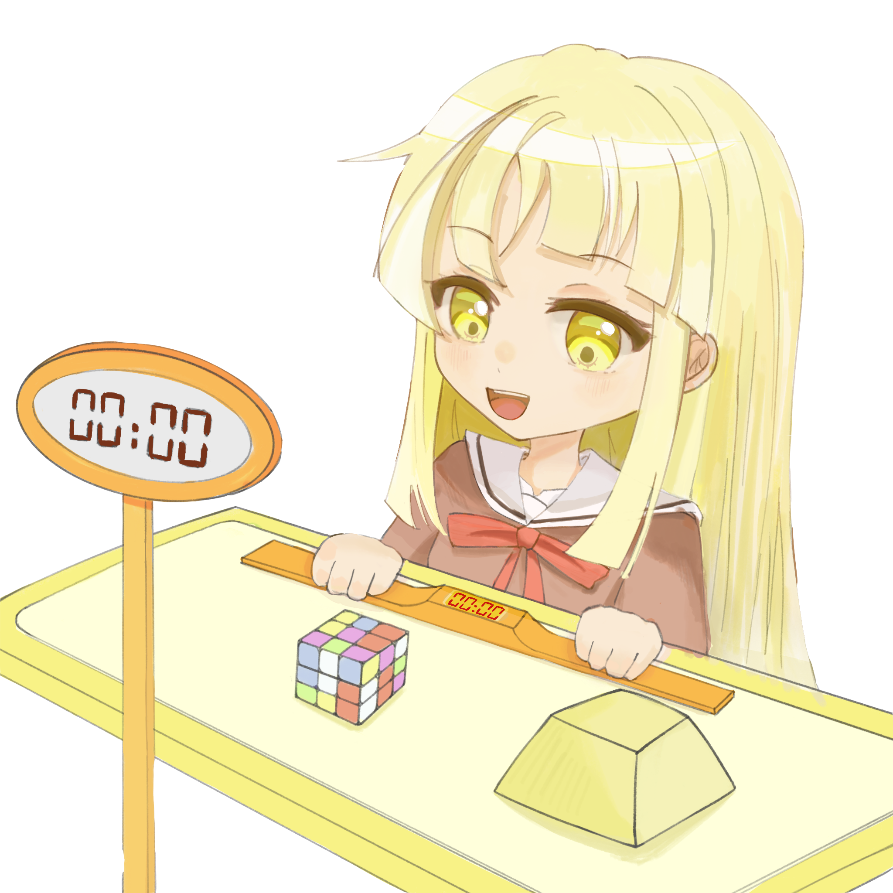

# [AutoBangDream(developing)](https://github.com/MoYuFang/AutoBangDream)

  

  

AutoBangDream 是一个基于 "mumu 模拟器 + 模拟触控 + 图像识别" 的 BangDream 游戏脚本。

## 警告

> [!IMPORTANT]
> 本项目为个人学习与研究用途开发，不保证功能的稳定性与适用性。
>
> 本项目与 Craft Egg、Bushiroad、BanG Dream! 少女乐团派对！ 及其他相关公司、组织无任何从属或合作关系。
>
> 使用本项目可能会违反游戏的服务条款，甚至导致账号封禁或数据损坏。
>
> 作者不对因使用本项目所造成的任何后果承担责任，请自行评估风险并谨慎使用。

## 功能
- 演奏歌曲：开环控制下演奏歌曲，即背谱演奏

- 全模式刷取脚本：舞台挑战、自由演出、协力演出、挑战演出、巡回演出、竞技演出、团竞演出
  - 注：协力演出等多人模式中，暂且仅支持在大厅公开匹配

- 多选歌模式：单曲循环、列表顺序、随机选取、不指定选曲

- 多表现模式：自定义 [Perfect, Great, Good, Bad, Miss] 比例；可选禁 FC
  - 注：开环控制+随机，不保证严格遵循比例）

- 歌曲识别：通过准备界面的歌曲名称识别歌曲
  - 注：BangDream 全游目前仅有两对同名不同谱的歌曲（シル・ヴ・プレジデント(389,462)，閃光(410,467)，但部分难度的 Level 不同，仅在 Hard 及以下难度出现无法区分的情况，固定难度为 Expert 即可规避，故暂时不打算做区分

- 控分计算器

## 缺陷
- [ ] 在每次启动脚本时，需手动进行一次"主机-模拟器"时差同步，否则无法正确演出
- [ ] 对主机性能要求高，掉帧严重影响歌曲演奏
- [ ] 图像识别基于神经网络，有极低概率出错（但随图片库增多，出错概率降低）
- [ ] 歌谱爬取依赖第三方网站

## 未来
按 "重要程度" 排序，"⭐️" 代表难度
- [ ] ⭐️ 调试 & 发布 & 自动更新
- [ ] ⭐️⭐️ GUI
- [ ] ⭐️⭐️⭐️ 自动、稳定、无感同步 "主机-模拟器" 时差
- [ ] ⭐️⭐️ 多人模式中，自动抓取 Bangdori 车站车牌，自动进入房间
- [ ] ⭐️ 自动补火
- [ ] ⭐️⭐️⭐️ 歌曲演奏实现闭环控制
- [ ] ⭐️⭐️⭐️ 支持多分辨率，支持移动端

## 参考 & 致谢

[Bangdream 判定规则](https://bbs.nga.cn/read.php?tid=37717081&rand=669)

[bestdori](https://bestdori.com/info/songs/)

[minitouch](https://github.com/openstf/minitouch)

[pytorch](https://github.com/pytorch/pytorch)

[deepseek](https://chat.deepseek.com/)

## 安装

(developing)

## 使用

(developing)
